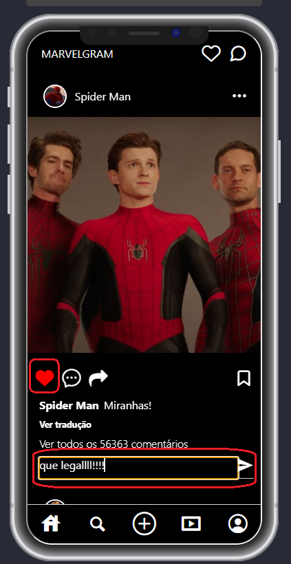
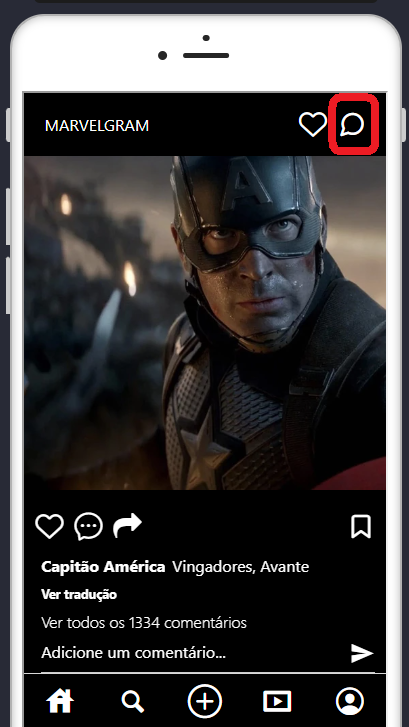

# Júlia Lima / Turma 13 - Serratec

## Descrição do Projeto

Trabalho Final Individual da Matéria de DESENVOLVIMENTO DE APLICATIVO MOBILE ministrada pelo professor João Felipe da Silva Braçanca para a turma 13 - Residência SERRATEC/2023.2

## Instalação e execução do projeto

-Git clone: https://github.com/juliafclima/cloneMarvegram.git

## Funcionalidades do projeto
Projeto Disciplina DESENVOLVIMENTO DE APLICATIVO MOBILE
Entrega via link do Github.

Clonar uma tela de algum app a sua escolha, pode ser algum aplicativo que você tenha, goste, ou qualquer tela que você achar ao pesquisar na internet.

Requisitos:
- Conter um README.md com a descrição do projeto, print da tela a ser clonada e o print do clone;
- Instalar o React Navigation e configurar 2 rotas;
- Ter um botão na página clonada habilitado para navegar para a segunda Rota;
- A segunda rota deve conter um Input vinculado a um State e um Botão TouchableOpacity;

Extra: Salvar a informação do input no dispositivo ao clicar no botão!

## Screens

Tela clonada: Instagram

GIF Marvelgram

- Home - tela principal do aplicativo
   

A página exibe histórias de personagens da Marvel, representadas por imagens importadas. O estado do componente é gerenciado pelo Hook useState, abrangendo tanto os comentários quanto as postagens curtidas. Além disso, a página inclui a funcionalidade de navegação para uma tela de mensagens.

- Posibilidade de dar Like na publicação e utilizar o input do comentário

A interface do usuário é projetada de forma a permitir a visualização das histórias e postagens, com elementos interativos para interações do     
usuário, como curtir e comentar.

- Mensagem

O código gerencia o estado do componente por meio do Hook useState. O estado messages armazena uma lista de mensagens, enquanto newMessage guarda o conteúdo da nova mensagem inserida pelo usuário. A função handleSendMessage adiciona uma nova mensagem à lista após verificar se a mensagem não está vazia. A interface exibe as mensagens em uma FlatList. A interação do usuário ocorre por meio de um campo de entrada de texto e um botão "Enviar".

- Pagina de manutenção

A interface consiste em um cabeçalho exibindo o nome do aplicativo e ícones de opções (coração e mensagem), indicando funcionalidades indisponíveis durante a manutenção. Além disso, há um botão "Voltar para Home", que, quando pressionado, direciona o usuário de volta à tela principal ("Home") por meio do React Navigation.

## Ferramentas e tecnologias
- [Git](https://git-scm.com/) 

- [GitHub](https://github.com/) 

- [JavaScript](https://developer.mozilla.org/pt-BR/docs/Web/JavaScript) 

- [React](https://react.dev/) 

- [Node](https://nodejs.org/en) 

- [NPM](https://www.npmjs.com/) 

## Autora

<a href="https://www.linkedin.com/in/juliafclima/">
 
  </a>
 
 

## Licença
Esse repositório está licenciado pelo MIT LICENSE(https://opensource.org/license/mit/). Para mais informações detalhadas, leia o arquivo LICENSE contido nesse repositório.
